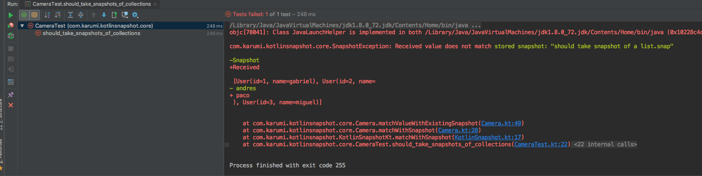

#  KotlinSnapshot [](https://travis-ci.org/Karumi/KotlinSnapshot) 

Snapshot Testing framework for Kotlin.

## What is this?

Snapshot testing is an assertion strategy based on the comparision of the instances serialized using a human readable format we version as part of the repository source code.

## Getting started

Add our Gradle Plugin to your ```build.gradle``` file: 

``` gradle
buildscript {
  repositories {
    mavenCentral()
  }
  dependencies {
    classpath 'com.karumi.kotlinsnapshot:plugin: version '2.2.0'
  }
}

apply plugin: 'com.karumi.kotlin-snapshot'
```

Invoke the extension function named ``matchWithSnapshot`` from any instance. The name of the snapshot is not mandatory, if you don't specify it as the first ``matchWithSnapshot`` param the library will infer it from the test execution context. Example:

``` kotlin
package com.mypackage

class NetworkTest {

    private val networkClient = MyNetworkClient()

    @Test
    fun shouldFetchDataFromNetwork() {
        val myData = networkClient.fetchData()
        myData.matchWithSnapshot()
    }

    @Test
    fun shouldFetchDataFromNetworkWithSpecificSnapshotName() {
        val myData = networkClient.fetchData()
        myData.matchWithSnapshot("should fetch the data from the network")
    }

```

If you need to customize the snapshots folder path you can create an instance of `KotlinSnapshot` in your test file and use the method `matchWithSnapshot`, which takes 2 arguments: A string with the name of the snapshot and an `Any` object to be saved using its json serialized version using a customized version of GSON.

``` kotlin
val kotlinSnapshot = KotlinSnapshot(relativePath = "src/test/kotlin/com/my/package")
``` 

After you run the test for the first time, a new snapshot will be written in the `__snapshot__` directory of the root of your project. The written snapshot for this example would look like this:

```bash
$ cat __snapshot__/should\ fetch\ data\ from\ network.snap 
{"name":"gabriel","id":5}
```

You can also configure `KotlinSnapshot` to group every snapshot file into a directory named using the test class name:

``` kotlin
val kotlinSnapshot = KotlinSnapshot(relativePath = "src/test/kotlin/com/my/package", testClassAsDirectory = true)
``` 

The snapshot will be generated inside a directory with the name of the test instead of putting it in `__snapshot__` folder. In the previous example, the test will be created inside `com.mypackage.NetworkTest`:

```bash
$ cat __snapshot__/my.package.NetworkTest/should\ fetch\ data\ from\ network.snap 
{"name":"gabriel","id":5}
``` 

On subsequent runs, the value will be compared with the snapshot stored in the filesystem if they are not equal, your test will fail. To see the detailed error you may need to run your tests with `./gradlew test --info`. You should see something like this:



## Updating Snapshots

In order to update snapshots from the command line, you just need to execute one command:

```
./gradlew updateSnapshots
```

## Purging Snapshots

As you rename snapshots, old unused snapshots may remain in your project. You can delete all existing snapshots and rebuild the ones that are actually used using the "purgeSnapshots" gradle task

```
./gradlew purgeSnapshots
```

## Contributing

### Linting and formatting

This repository uses [ktlint](https://github.com/shyiko/ktlint). This Gradle plugin ensures the code style is homogeneous and always correct thanks to the evaluation of the code during the build execution. You can use these commands in order to check if the code changes passes the repository codestyle and to format the code automatically:

```
./gradlew ktlint //Checks if the project passes the checkstyle.
./gradlew ktlintFormat //Formats the code for you
```

### Running tests

This project contains some tests written using JUnit. You can easily run the tests by executing the following commands:

```
./gradlew test //Run every test.
./gradlew test -t //Run every test using the watch mode.
./gradlew test --tests "com.xyz.b.module.TestClass.testToRun" //Run a single test
```

## Customizing serializations

KotlinSnapshot uses custom serialization for the basic types. If, for some reason, you want to implement your custom serializer you can create your own ``SerializationModule``. If you still want to reuse part of the serialization we provide you can compose your serializer as follows:

```kotlin
class CustomKotlinSerialization : SerializationModule {

        private val kotlinSerialization = KotlinSerialization()

        override fun serialize(value: Any?): String = when {
            value is LocalDate -> "custom serialization configured"
            else -> kotlinSerialization.serialize(value)
        }
}
```

Take into account that the ``KotlinSerialization`` class uses ``Gson`` under the hood. This class transforms your instances into json strings you can easily review when needed. On top of the json serialization we add some metadata really useful when serializing sealed hierarchies or objects. If for some reason you need to extend the serializer and use your own custom serializer also based on Gson you can do it as follows:

```kotlin
class CustomKotlinJsonSerialization: SerializationModule {

        private val customGson = KotlinSerialization.gsonBuilder
            .setDateFormat("yyyy-MM-dd")
            .create()

        override fun serialize(value: Any?): String = customGson.toJson(value)
}
```

### Changelog

#### 2.2.0 Improve diff coloring:

* User more conventional diff coloring
* Support window line endings replacing '\r\n' to '\n'

#### 2.1.1 Fixed JUnit 5 support:

#### 2.1.0 Improve IntelliJ and JUnit 5 support:

* Support for nullable types.
* Improved IntelliJ Support.
* Add JUnit 5 Support

#### 2.0.0 Improve the serialization format:

* We've replaced the old serialization format with a custom JSON format letting the user review the snapshots easily and unify the format. **If you update the library to a 2.X version or greater you'll have to record all your tests again.**

### Sending your PR

If you would like to contribute code to this repository you can do so through GitHub by creating a new branch in the repository and sending a pull request or opening an issue. Please, remember that there are some requirements you have to pass before accepting your contribution:

* Write clean code and test it.
* The code written will have to match the product owner requirements.
* Follow the repository code style.
* Write good commit messages.
* Do not send pull requests without checking if the project build is OK in the CI environment.
* Review if your changes affects the repository documentation and update it.
* Describe the PR content and don't hesitate to add comments to explain us why you've added or changed something.

License
-------

    Copyright 2018 Karumi

    Permission is hereby granted, free of charge, to any person 
    obtaining a copy of this software and associated documentation 
    files (the "Software"), to deal in the Software without restriction, 
    including without limitation the rights to use, copy, modify, merge, 
    publish, distribute, sublicense, and/or sell copies of the Software, 
    and to permit persons to whom the Software is furnished to do so, 
    subject to the following conditions:
    
    The above copyright notice and this permission notice shall be included
    in all copies or substantial portions of the Software.
    
    THE SOFTWARE IS PROVIDED "AS IS", WITHOUT WARRANTY OF ANY KIND, EXPRESS
    OR IMPLIED, INCLUDING BUT NOT LIMITED TO THE WARRANTIES OF MERCHANTABILITY,
    FITNESS FOR A PARTICULAR PURPOSE AND NONINFRINGEMENT. IN NO EVENT SHALL
    THE AUTHORS OR COPYRIGHT HOLDERS BE LIABLE FOR ANY CLAIM, DAMAGES OR OTHER
    LIABILITY, WHETHER IN AN ACTION OF CONTRACT, TORT OR OTHERWISE, ARISING FROM,
    OUT OF OR IN CONNECTION WITH THE SOFTWARE OR THE USE OR OTHER DEALINGS IN
    THE SOFTWARE.
